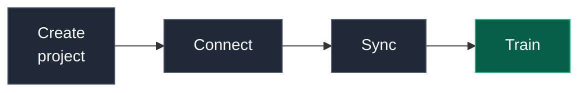
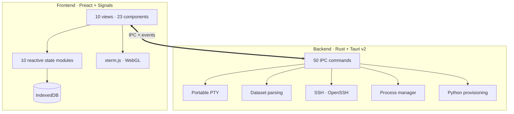

<div align="center">

<br>


<br>

### Train image models on your own machine.

**No cloud. No bills. No code.**

<br>

[](LICENSE)
[](../../releases/latest)
[](../../stargazers)
[](../../issues)
[](../../pulls)
[](../../commits)

<br>


-x64-FCC624?style=for-the-badge&logo=linux&logoColor=black)

<br>

[](https://v2.tauri.app)
[](https://www.rust-lang.org)
[](https://preactjs.com)
[](https://vitejs.dev)

<br>


<br>
<br>

<table>
<tr>
<td align="center" width="33%">

**New to this?**

[Install](#install) → [First model](#train-your-first-model) → [Your data](#prepare-your-dataset)

</td>
<td align="center" width="33%">

**Done this before?**

[Advanced](#advanced-training) · [Remote GPUs](#train-on-a-remote-gpu) · [Export](#export--deploy)

</td>
<td align="center" width="33%">

**Here to hack?**

[Architecture](#architecture) · [Build from source](#build-from-source)

</td>
</tr>
</table>

</div>

---

## What is NightFlow?

Point it at a folder of labelled images. Pick a task. Press **Start Training**.

It writes the config, runs the job, streams metrics into live charts, and keeps a
searchable history of every run — all on your own hardware.

<table>
<tr>
<td width="50%" valign="top">

#### If you've never trained a model

A seven-step wizard walks you through it and picks sensible defaults for everything
you don't set. You never touch a config file or a terminal.

</td>
<td width="50%" valign="top">

#### If you do this for a living

Every default is overridable — optimizer, scheduler, precision, gradient clipping,
augmentation policy, accelerator, device IDs — and the YAML it emits is a plain
[AutoTimm](https://github.com/theja-vanka/AutoTimm) config you can read and diff.

</td>
</tr>
</table>

> [!NOTE]
> **Everything stays on your machine.** No account, no telemetry, no upload. Runs live in
> local storage; your images never leave the disk they're on.

---

## Install

<table>
<tr>
<td width="50%" valign="top">

**Download a build**

| Platform | Arch | Formats |
| :--- | :--- | :--- |
| **macOS** | ARM64 / x64 | `.dmg` |
| **Linux** | x64 | `.deb` · `.AppImage` |

From the **[Releases](../../releases/latest)** page.

</td>
<td width="50%" valign="top">

**Or use Homebrew**

```bash
brew tap theja-vanka/nightflow \
  https://github.com/theja-vanka/NightFlow
brew install --cask nightflow
```

</td>
</tr>
</table>

> [!IMPORTANT]
> You need **Python 3.12** on the machine that trains. That's all — NightFlow builds its
> own isolated environment and installs AutoTimm into it during **Sync**.

<details>
<summary><b>Windows?</b></summary>

<br>

Windows builds are paused. You can still [build from source](#build-from-source), but
it's untested.

</details>

---

## Train your first model



<table>
<tr>
<td width="25%" valign="top">

#### 1 · Create

Click **+** in the sidebar and answer seven short questions.

</td>
<td width="25%" valign="top">

#### 2 · Connect

Instant for local projects. Remote ones open an SSH session.

</td>
<td width="25%" valign="top">

#### 3 · Sync

Builds the Python env and validates your dataset. **Don't skip it.**

</td>
<td width="25%" valign="top">

#### 4 · Train

<kbd>Ctrl</kbd>+<kbd>Enter</kbd>. Charts update live.

</td>
</tr>
</table>

<details>
<summary><b>What the wizard asks — and what to pick if you're unsure</b></summary>

<br>

| Step | What it's asking | If unsure |
| :--- | :--- | :--- |
| **Connection** | This computer, or a remote GPU over SSH? | **Localhost** |
| **Name** | A name and folder for the project | Default path is fine |
| **Task** | Classification, detection, segmentation… | **Classification** |
| **Backbone** | Model size tier | **Edge** — trains fast |
| **Dataset** | Where your images live, and how they're laid out | [See below](#prepare-your-dataset) |
| **Advanced** | Epochs, learning rate, batch size… | Skip it |
| **Confirm** | Review, then **Create** | — |

</details>

<details>
<summary><b>What Sync actually does</b> — and why the sidebar is half empty until you run it</summary>

<br>

Sync is the step people skip and then wonder why nothing works. It:

- creates the project directory
- builds a Python 3.12 environment with [uv](https://github.com/astral-sh/uv) and installs AutoTimm
- checks every dataset path you gave it exists
- validates the layout matches the format you chose
- imports any runs already in the project folder

Until a project is connected **and** synced, the sidebar shows only Dashboard and
Settings — the other views have nothing to display yet.

</details>

---

## Prepare your dataset

This is where most first attempts go wrong. Here's exactly what each option expects.

| Task | Formats |
| :--- | :--- |
| **Classification** | Folder · CSV |
| **Multi-Label Classification** | CSV · JSONL |
| **Object Detection** | COCO JSON · CSV |
| **Semantic Segmentation** | PNG Masks · COCO · Cityscapes · VOC · CSV |
| **Instance Segmentation** | COCO JSON · CSV |

<details open>
<summary><b>Classification via folders</b> — the simplest option</summary>

<br>

One subfolder per class:

```
dataset/
├── cat/     img001.jpg  img002.jpg  …
├── dog/     img087.jpg  img088.jpg  …
└── bird/    img142.jpg  img143.jpg  …
```

Point NightFlow at `dataset/` — it detects class names and counts for you.

</details>

<details>
<summary><b>Classification via CSV</b></summary>

<br>

One row per image. Column names are yours — you map them in the wizard's
**CSV columns** fields:

```csv
image_path,label
images/img001.jpg,cat
images/img002.jpg,dog
```

Relative paths resolve against the **image root directory**. Supply separate
`train` / `val` / `test` files (validation is optional).

</details>

<details>
<summary><b>Segmentation datasets</b></summary>

<br>

For both segmentation tasks the root directory resolves image **and** mask paths.
CSV mode maps `image_path` to `mask_path`; instance segmentation adds a label and
instance ID per row.

</details>

> [!TIP]
> Use the **Dataset** view to see what NightFlow actually parsed — per-class counts,
> split detection, and the images themselves — before spending a GPU-hour on it.

---

## What you get

<table>
<tr>
<td width="50%" valign="top">

### While it trains

- **Live charts** — loss and accuracy as the job runs
- **Real terminal** — full PTY if you want raw output
- **System metrics** — CPU, memory, NVIDIA GPU
- **Training queue** — line up runs back to back
- **Crash recovery** — reattaches and replays the log

</td>
<td width="50%" valign="top">

### After it trains

- **Run history** — searchable, sortable, comparable
- **Confusion matrix** — train, validation and test
- **Per-class metrics** — precision, recall, F1
- **Model viewer** — architecture via [Netron](https://netron.app)
- **Interpretation** — six attribution methods

</td>
</tr>
</table>

---

## Advanced training

Turn on **Power User Mode** (Settings → General) to unlock the **Advanced Training** tab.
Leave anything blank and it falls through to the AutoTimm default.

<details>
<summary><b>The full settings matrix</b></summary>

<br>

| Group | Settings |
| :--- | :--- |
| **Basics** | Max epochs · learning rate · batch size · weight decay · optimizer (AdamW/Adam/SGD) · scheduler (cosine/step/onecycle/none) |
| **Early stopping** | On/off · monitored metric · patience |
| **Precision & data** | Precision (32 / 16-mixed / bf16-mixed) · image size · augmentation preset · gradient clipping |
| **Compute** | Accelerator (auto/CUDA/MPS/CPU) · GPU device IDs · dataloader workers · `torch.compile` |
| **Reproducibility** | Seed · freeze backbone |

> Settings lock while a project is connected. Disconnect to edit — this stops you
> changing config out from under a running job.

</details>

<details>
<summary><b>The generated config</b> — nothing is hidden</summary>

<br>

NightFlow writes a standard AutoTimm YAML, and every run stores the exact config it
used, so a result from three weeks ago is reproducible today.

```yaml
seed_everything: 42
model:
  class_path: autotimm.tasks.ImageClassifier
  init_args:
    backbone: mobilenetv2_100
    num_classes: 3
    lr: 0.001
data:
  class_path: autotimm.data.ImageDataModule
  init_args:
    train_csv: /data/train.csv
    image_dir: /data/images/
    batch_size: 32
trainer:
  max_epochs: 10
  accelerator: auto
  precision: 32-true
```

</details>

<details>
<summary><b>Keyboard shortcuts</b></summary>

<br>

| Keys | Action |
| :--- | :--- |
| <kbd>Ctrl</kbd>/<kbd>Cmd</kbd> + <kbd>1</kbd>…<kbd>7</kbd> | Jump between views |
| <kbd>Ctrl</kbd>/<kbd>Cmd</kbd> + <kbd>Enter</kbd> | Start training |
| <kbd>Cmd</kbd> + <kbd>K</kbd> | Shortcut reference |

<kbd>Ctrl</kbd>+<kbd>K</kbd> is deliberately left to the shell when the terminal has
focus, so readline's kill-line still works.

</details>

### Augmentation, previewed

Pick a preset — `default`, `light`, `autoaugment`, `randaugment` or `trivialaugment` —
then press **Preview** and drop in a sample image. Six variants come back from the same
pipeline training will use, so you see what the policy does to your data *before*
committing to it.

---

## Train on a remote GPU

Choose **Remote Instance** and give NightFlow the SSH command you'd type yourself:

```bash
ssh -i ~/.ssh/gpu_box -p 2222 ubuntu@203.0.113.10
```

It shells out to your system's OpenSSH, so keys, `~/.ssh/config` aliases, jump hosts and
agent forwarding all behave normally. Sync provisions the remote box, training runs
there, and metrics stream back into the same charts.

> [!TIP]
> Checkpoints stay remote until you ask for them — the Model Viewer and export pull
> them down on demand.

---

## Understand what the model learned

<table>
<tr>
<td width="33%" valign="top">

**GradCAM**
**GradCAM++**

Which region drove the prediction. `++` handles multiple objects better.

</td>
<td width="33%" valign="top">

**Integrated Gradients**
**SmoothGrad**

Pixel-level attribution. SmoothGrad denoises it.

</td>
<td width="33%" valign="top">

**Attention Rollout**
**Attention Flow**

For Vision Transformers specifically.

</td>
</tr>
</table>

---

## Export & deploy

| Target | Notes |
| :--- | :--- |
| **TorchScript** (`.pt`) | PyTorch-native — CPU, CUDA or MPS |
| **ONNX** (`.onnx`) | Cross-platform — CPU, CUDA or CoreML |
| **TensorRT** (`.engine`) | NVIDIA-optimised — needs a GPU on the training machine |
| **Hugging Face Hub** | Push straight to a repo with model-card metadata |

---

## Architecture

A Tauri v2 shell: Preact front end, Rust core, IPC between them. No bundled browser
engine, no Node runtime in the shipped app.



<details>
<summary><b>Why these choices</b></summary>

<br>

| Layer | Choice | Why |
| :--- | :--- | :--- |
| UI | Preact + Signals | Fine-grained reactivity — no VDOM diff per metric tick |
| Terminal | xterm.js + WebGL | Handles high-volume training output without dropping frames |
| Backend | Rust (2024 edition) | Long-lived process supervision and log tailing |
| Process | portable-pty + Tokio | A real PTY, so tqdm progress bars render correctly |
| Storage | IndexedDB | Local-only by construction |
| Training | [AutoTimm](https://github.com/theja-vanka/AutoTimm) | timm backbones on PyTorch Lightning |

</details>

<details>
<summary><b>Where things live</b></summary>

<br>

```
src/
├── views/          10 top-level screens
├── components/     23 shared components
├── state/          10 signal modules (projects, training, dashboard, …)
├── db/             IndexedDB access
└── utils/          config generation, model catalog, export

src-tauri/src/
├── training.rs        process supervision, log tailing, crash recovery
├── fs.rs              dataset parsing and structure validation
├── env.rs             Python/uv environment provisioning
├── interpretation.rs  attribution, augmentation preview, JIT export
├── pty.rs             terminal sessions
├── ssh.rs             remote execution
├── runs.rs            run/metric parsing
└── system.rs          CPU/memory/GPU metrics
```

</details>

---

## Build from source

```bash
git clone https://github.com/theja-vanka/NightFlow.git
cd NightFlow
npm install --legacy-peer-deps   # or: bun install
npx tauri dev                    # or: bunx tauri dev
```

The first run compiles the Rust backend and takes a few minutes. After that it's
incremental.

<details>
<summary><b>Prerequisites &amp; commands</b></summary>

<br>

| Requirement | Version |
| :--- | :--- |
| **Node.js** | 22+ |
| **Rust** | Stable (2024 edition) |
| **Bun** | Optional — npm works fine |

**Debian / Ubuntu** — install the Tauri system libraries first:

```bash
sudo apt-get update && sudo apt-get install -y \
  libwebkit2gtk-4.1-dev libappindicator3-dev librsvg2-dev \
  patchelf libgtk-3-dev libsoup-3.0-dev libjavascriptcoregtk-4.1-dev
```

| Task | Command |
| :--- | :--- |
| Full app (hot reload) | `npx tauri dev` |
| Front end only | `npm run dev` |
| Lint | `npm run lint` |
| JS tests | `npm test` |
| Rust tests + lint | `cd src-tauri && cargo test && cargo clippy` |
| Build installers | `npx tauri build` |

`npm test` checks that the YAML NightFlow generates is accepted by AutoTimm across every
task, format and accelerator combination. `tests/check_autotimm_config.py` validates the
same configs against a real AutoTimm install.

</details>

---

## Troubleshooting

<details>
<summary><b>Something isn't working</b></summary>

<br>

| Symptom | Cause |
| :--- | :--- |
| **Sidebar only shows Dashboard and Settings** | Not connected and synced yet. Connect, then Sync. |
| **Settings fields greyed out** | Settings lock while connected — disconnect to edit. |
| **Training fails immediately** | Sync didn't finish. Check the Python environment step in the sync log. |
| **"No augmented images generated"** | AutoTimm isn't in the project environment — re-run Sync. |
| **TensorRT export unavailable** | No NVIDIA GPU detected on the training machine. |
| **Dataset shows zero images** | Wrong paths, or the layout doesn't match the chosen format. The Dataset view shows what was parsed. |

Still stuck? Open an [issue](../../issues) with the sync log — fastest route to a
diagnosis.

</details>

---

## Contributing

Issues and pull requests are welcome.

1. Fork the repository
2. Branch — `git checkout -b feat/your-feature`
3. Keep `npm run lint`, `npm test` and `cargo clippy` clean
4. Open a pull request

Full docs: **[theja-vanka.github.io/NightFlow](https://theja-vanka.github.io/NightFlow/)**

---

## License

[Apache 2.0](LICENSE)

<div align="center">
<br>

**Built by [Krishnatheja Vanka](https://github.com/theja-vanka)**

If NightFlow saved you time or cloud bills, a helps.

<a href="https://www.buymeacoffee.com/theja.vanka" target="_blank"></a>

<br>
</div>
