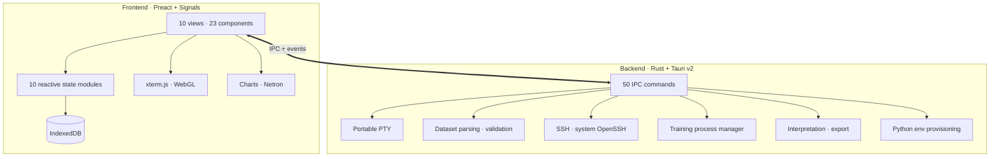

<div align="center">

<br>


<br>

### Train image models on your own machine. No cloud, no bills, no code.

A desktop app that takes you from a folder of images to a deployable
model — with the charts, run history and explainability built in.

<br>

[](LICENSE)
[]()
[](../../stargazers)
[](../../issues)
[](../../pulls)
[](../../commits)

<br>


-x64-FCC624?style=for-the-badge&logo=linux&logoColor=black)

<br>

[](https://v2.tauri.app)
[](https://www.rust-lang.org)
[](https://preactjs.com)
[](https://vitejs.dev)

<br>

**New here?** [Install](#install) · [Train your first model](#train-your-first-model) · [Prepare your dataset](#prepare-your-dataset)
<br>
**Know your way around?** [Advanced training](#advanced-training) · [Remote GPUs](#train-on-a-remote-gpu) · [Export](#export-and-deploy) · [Architecture](#architecture) · [Build from source](#build-from-source)

<br>


<br>

</div>

---

## What is NightFlow?

NightFlow is a desktop application for training computer-vision models. You point it
at a folder of labelled images, pick what kind of model you want, and press **Start
Training**. It writes the training config, runs the job, streams the metrics into live
charts, and keeps a searchable history of every run.

It exists because the alternative is usually one of two bad options: rent a cloud AutoML
service that charges per training hour and keeps your images, or wire up PyTorch,
Lightning, timm, logging and checkpointing yourself before you can train anything at all.

**If you have never trained a model before**, the project wizard walks you through it in
seven short steps and picks sensible defaults for everything you don't set.

**If you do this for a living**, every default is overridable — optimizer, scheduler,
precision, gradient clipping, augmentation policy, accelerator, GPU device IDs — and the
YAML it generates is a plain [AutoTimm](https://github.com/theja-vanka/AutoTimm) config
you can read, diff, and run yourself.

> **Everything stays on your machine.** No account, no telemetry, no upload. Runs and
> project settings live in local storage; your images never leave the disk they're on.

---

## Install

Download a build for your platform from the
**[Releases](../../releases/latest)** page.

| Platform | Architecture | Formats |
| :--- | :--- | :--- |
| **macOS** | ARM64 / x64 | `.dmg` |
| **Linux** (Debian / Ubuntu) | x64 | `.deb` · `.AppImage` |

On macOS you can install with Homebrew instead:

```bash
brew tap theja-vanka/nightflow https://github.com/theja-vanka/NightFlow
brew install --cask nightflow
```

> [!NOTE]
> Windows builds are paused for now. You can still
> [build from source](#build-from-source) on Windows, but it is untested.

### One thing to install yourself

NightFlow trains through Python. You need **Python 3.12** available on the machine that
does the training. You do *not* need to create a virtual environment or `pip install`
anything — the **Sync** step below builds an isolated environment inside your project
folder and installs AutoTimm into it.

---

## Train your first model

The whole flow is: **create a project → connect → sync → train**.

### 1. Create a project

Click **+** in the sidebar. The wizard asks seven things:

| Step | What it's asking | If you're unsure |
| :--- | :--- | :--- |
| **Connection** | Train on this computer, or a remote GPU box over SSH? | Choose **Localhost** |
| **Name** | A name and a folder for the project | The default path is fine |
| **Task** | Classification, detection, segmentation… | **Classification** — one label per image |
| **Backbone** | Model size tier | **Edge** to start; it trains fast |
| **Dataset** | Where your images are and how they're organised | See [Prepare your dataset](#prepare-your-dataset) |
| **Advanced** | Epochs, learning rate, batch size… | Skip it — defaults are sensible |
| **Confirm** | Review everything | Press **Create** |

### 2. Connect

On the Dashboard, press **Connect**. For a local project this is instant. For a remote
one it opens an SSH session using your system's own `ssh`, so your existing keys and
`~/.ssh/config` work as they already do.

### 3. Sync

Press **Sync**. This is the step people skip and then wonder why nothing works — it is
what actually prepares the machine:

- creates the project directory
- builds a Python 3.12 environment with [uv](https://github.com/astral-sh/uv) and
  installs the latest AutoTimm into it
- checks every dataset path you gave it actually exists
- validates that your dataset is laid out the way the chosen format expects
- imports any training runs already in the project folder

Until a project is connected **and** synced, the sidebar only shows Dashboard and
Settings. That's deliberate — the other views have nothing to show yet.

### 4. Train

Press **Start Training** (or <kbd>Ctrl</kbd>/<kbd>Cmd</kbd> + <kbd>Enter</kbd>). Loss and
accuracy stream into the charts live. When it finishes, the run appears in
**Experiments** with its metrics and hyperparameters, and you can compare it against
every other run you've done.

---

## Prepare your dataset

This is the part that most often goes wrong, so here is exactly what each option expects.

### Classification — folder layout

The simplest option. One subfolder per class:

```
dataset/
├── cat/     img001.jpg  img002.jpg  …
├── dog/     img087.jpg  img088.jpg  …
└── bird/    img142.jpg  img143.jpg  …
```

Point NightFlow at `dataset/` and it detects the class names and counts for you.

### Classification — CSV

One row per image. Column names are yours to choose — you tell NightFlow which is which
in the wizard's **CSV columns** fields:

```csv
image_path,label
images/img001.jpg,cat
images/img002.jpg,dog
```

Relative paths are resolved against the **image root directory** you set. You supply
separate `train` / `val` / `test` CSVs (validation is optional).

### Every task and the formats it accepts

| Task | Formats | Notes |
| :--- | :--- | :--- |
| **Classification** | Folder · CSV | One label per image |
| **Multi-Label Classification** | CSV · JSONL | An image column plus one `0`/`1` column per label |
| **Object Detection** | COCO JSON · CSV | CSV rows carry image path, bounding box and label |
| **Semantic Segmentation** | PNG Masks · COCO · Cityscapes · VOC · CSV | CSV maps `image_path` to `mask_path` |
| **Instance Segmentation** | COCO JSON · CSV | CSV carries image, mask path, label and instance ID |

For both segmentation tasks, the root directory you set resolves image **and** mask
paths. Use the **Dataset** view to browse what NightFlow actually parsed — per-class
counts, split detection, and the images themselves — before you spend a GPU-hour on it.

---

## What you get

| | |
| :--- | :--- |
| **Live training** | Loss/accuracy charts that update as the job runs, plus a full PTY terminal if you want the raw output |
| **Run history** | Every run with its metrics, hyperparameters and config — searchable, sortable, and comparable side by side |
| **Dataset browser** | Visual explorer with class filtering, search and split detection |
| **Confusion matrix** | Per-class breakdown across train, validation and test |
| **Per-class metrics** | Precision, recall and F1 for every class |
| **Model viewer** | The trained architecture rendered with [Netron](https://netron.app) |
| **Interpretation** | Six attribution methods — see [below](#understand-what-the-model-learned) |
| **Training queue** | Queue several runs and let them execute one after another |
| **Crash recovery** | If the app exits mid-run, it reattaches to the training process and replays the log on restart |
| **System metrics** | Live CPU, memory and NVIDIA GPU utilisation |

---

## Advanced training

Turn on **Power User Mode** (Settings → General) to unlock the **Advanced Training** tab.
Anything you leave blank falls through to the AutoTimm default rather than being forced
to a value.

| Group | Settings |
| :--- | :--- |
| **Basics** | Max epochs · learning rate · batch size · weight decay · optimizer (AdamW/Adam/SGD) · scheduler (cosine/step/onecycle/none) |
| **Early stopping** | On/off · monitored metric · patience |
| **Precision & data** | Precision (32 / 16-mixed / bf16-mixed) · image size · augmentation preset · gradient clipping |
| **Compute** | Accelerator (auto/CUDA/MPS/CPU) · GPU device IDs · dataloader workers · `torch.compile` |
| **Reproducibility** | Seed · freeze backbone |

> [!NOTE]
> Settings are locked while a project is connected. Disconnect to edit them — this stops
> you changing the config out from under a running job.

### Augmentation, previewed

Pick a preset — `default`, `light`, `autoaugment`, `randaugment` or `trivialaugment` —
then press **Preview** and drop in a sample image. You get six augmented variants back,
generated by the same transform pipeline training will use, so you can see what the
policy actually does to your data before committing to it.

### The generated config

NightFlow doesn't hide the training config. It writes a standard AutoTimm YAML:

```yaml
seed_everything: 42
model:
  class_path: autotimm.tasks.ImageClassifier
  init_args:
    backbone: mobilenetv2_100
    num_classes: 3
    lr: 0.001
data:
  class_path: autotimm.data.ImageDataModule
  init_args:
    train_csv: /data/train.csv
    image_dir: /data/images/
    batch_size: 32
trainer:
  max_epochs: 10
  accelerator: auto
  precision: 32-true
```

Every run stores the exact config it used, so a result you got three weeks ago is
reproducible today.

### Keyboard shortcuts

| Keys | Action |
| :--- | :--- |
| <kbd>Ctrl</kbd>/<kbd>Cmd</kbd> + <kbd>1</kbd>…<kbd>7</kbd> | Jump to Dashboard, Experiments, Dataset, Interpretation, Model Viewer, Terminal, Settings |
| <kbd>Ctrl</kbd>/<kbd>Cmd</kbd> + <kbd>Enter</kbd> | Start training |
| <kbd>Cmd</kbd> + <kbd>K</kbd> | Shortcut reference |

<kbd>Ctrl</kbd> + <kbd>K</kbd> is deliberately left to the shell when the terminal has
focus, so readline's kill-line still works.

---

## Train on a remote GPU

Choose **Remote Instance** in the wizard and give NightFlow the SSH command you'd type
yourself:

```
ssh -i ~/.ssh/gpu_box -p 2222 ubuntu@203.0.113.10
```

It shells out to your system's OpenSSH, so keys, `~/.ssh/config` aliases, jump hosts and
agent forwarding all behave normally. Sync provisions the Python environment on the
remote box, training runs there, and metrics stream back into the same charts. The
built-in terminal gives you a real shell on that machine when you need one.

> Checkpoints stay remote until you ask for them; the Model Viewer and export pull them
> down on demand.

---

## Understand what the model learned

The **Interpretation** view runs six attribution methods against a trained checkpoint and
a sample image:

| Method | Good for |
| :--- | :--- |
| **GradCAM** · **GradCAM++** | Which region drove the prediction; `++` handles multiple objects better |
| **Integrated Gradients** · **SmoothGrad** | Pixel-level attribution; SmoothGrad denoises it |
| **Attention Rollout** · **Attention Flow** | Vision Transformers specifically |

---

## Export and deploy

| Target | Notes |
| :--- | :--- |
| **TorchScript** (`.pt`) | PyTorch-native, CPU/CUDA/MPS |
| **ONNX** (`.onnx`) | Cross-platform; CPU, CUDA or CoreML providers |
| **TensorRT** (`.engine`) | NVIDIA-optimised — requires a GPU on the training machine |
| **Hugging Face Hub** | Push straight to a repo with model-card metadata |

---

## Architecture

A Tauri v2 shell: a Preact front end talking to a Rust core over IPC, with no browser
engine bundled and no Node runtime in the shipped app.



| Layer | Choice | Why |
| :--- | :--- | :--- |
| UI | Preact + Signals | Fine-grained reactivity without a virtual-DOM diff on every metric tick |
| Terminal | xterm.js + WebGL | Handles high-volume training output without dropping frames |
| Backend | Rust (2024 edition) | Long-lived process supervision and log tailing |
| Process | portable-pty + Tokio | A real PTY, so tqdm progress bars render correctly |
| Storage | IndexedDB | Local-only by construction |
| Training | [AutoTimm](https://github.com/theja-vanka/AutoTimm) | timm backbones on PyTorch Lightning |

```
src/
├── views/          10 top-level screens
├── components/     23 shared components
├── state/          10 signal modules (projects, training, dashboard, …)
├── db/             IndexedDB access
└── utils/          config generation, model catalog, export
src-tauri/src/
├── training.rs     process supervision, log tailing, crash recovery
├── fs.rs           dataset parsing and structure validation
├── env.rs          Python/uv environment provisioning
├── interpretation.rs  attribution methods, augmentation preview, JIT export
├── pty.rs          terminal sessions
├── ssh.rs          remote execution
├── runs.rs         run/metric parsing
└── system.rs       CPU/memory/GPU metrics
```

---

## Build from source

### Prerequisites

| Requirement | Version |
| :--- | :--- |
| **Node.js** | 22+ |
| **Rust** | Stable (2024 edition) |
| **Bun** | Optional — npm works fine |

> [!NOTE]
> **Debian / Ubuntu** — install the Tauri system libraries first:
> ```bash
> sudo apt-get update && sudo apt-get install -y \
>   libwebkit2gtk-4.1-dev libappindicator3-dev librsvg2-dev \
>   patchelf libgtk-3-dev libsoup-3.0-dev libjavascriptcoregtk-4.1-dev
> ```

### Run it

```bash
git clone https://github.com/theja-vanka/NightFlow.git
cd NightFlow
npm install --legacy-peer-deps   # or: bun install
npx tauri dev                    # or: bunx tauri dev
```

The first run compiles the Rust backend and takes a few minutes. After that it's
incremental.

| Task | Command |
| :--- | :--- |
| Full app (hot reload) | `npx tauri dev` |
| Front end only | `npm run dev` |
| Lint | `npm run lint` |
| JS tests | `npm test` |
| Rust tests + lint | `cd src-tauri && cargo test && cargo clippy` |
| Build installers | `npx tauri build` |

`npm test` covers config generation — that the YAML NightFlow writes is accepted by
AutoTimm for every task, format and accelerator combination. `tests/check_autotimm_config.py`
validates the same configs against a real AutoTimm install if you have one.

---

## Troubleshooting

| Symptom | Cause |
| :--- | :--- |
| **Sidebar only shows Dashboard and Settings** | The project isn't connected and synced yet. Connect, then Sync. |
| **Settings fields are greyed out** | Settings lock while connected — disconnect to edit. |
| **Training fails immediately** | Sync didn't finish. Open the sync log on the Dashboard and check the Python environment step. |
| **"No augmented images generated"** | AutoTimm isn't installed in the project environment — re-run Sync. |
| **TensorRT export unavailable** | No NVIDIA GPU detected on the training machine. |
| **Dataset shows zero images** | The paths in Settings → Dataset are wrong, or the layout doesn't match the chosen format. The Dataset view shows what was actually parsed. |

Still stuck? Open an [issue](../../issues) with the sync log — it's the fastest way to
get a diagnosis.

---

## Contributing

Issues and pull requests are welcome.

1. Fork the repository
2. Branch — `git checkout -b feat/your-feature`
3. Make sure `npm run lint`, `npm test` and `cargo clippy` are clean
4. Commit and push
5. Open a pull request

Full docs: **[theja-vanka.github.io/NightFlow](https://theja-vanka.github.io/NightFlow/)**

---

## License

[Apache 2.0](LICENSE).

<div align="center">
<br>

**Built by [Krishnatheja Vanka](https://github.com/theja-vanka)**

If NightFlow saved you time or cloud bills, a ⭐ helps.

<a href="https://www.buymeacoffee.com/theja.vanka" target="_blank"></a>

<br>
</div>
